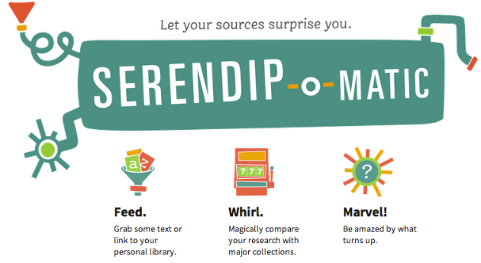

##Serendip-o-matic 
###[Start teaching with Serendip-o-matic](http://serendipomatic.org/) 

###Overview 

Serendip-o-matic is a fun and accessible online tool that links a section of written text to digital content hosted by libraries, museums, and archives. Not only is it a valuable resource for discovering new sources, but also for expanding the research materials already on hand. This fun tool emphasizes the discovery and exploration of online content.

###Documentation 

Read the documentation for Serendip-o-matic [here](http://serendipomatic.org/about/).

##Suggested Activities 

### Web research exercise 

Ask students to work at the intersection of composition and research by running a draft of their work through Serendip-o-matic. Exploring how potential primary and secondary sources correspond to written text will help students identify gaps pontential gaps in their research, explore instances of rich and reputable online material, and experience how serendipitous encounters with archival holdings inspire new ideas and improve one's writing. This exercise can be used to help students evaluate existing sources they have collected or to discover online scholarly content for the first time.