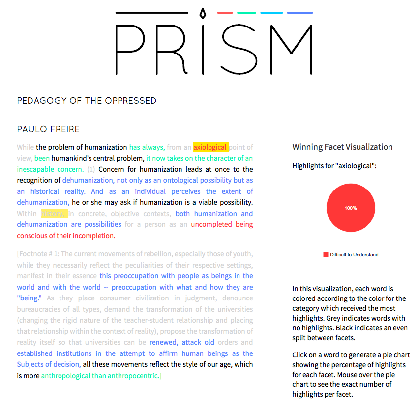

##PRISM 
###[Start teaching with PRISM](http://prism.scholarslab.org/) 

###Overview 

PRISM is a tool for crowdsourced interpretation created by Scholarslab. It lets multiple contributors add their interpretations of texts online by highlighting key terms, concepts, and sections in the text. The aggregate interpretation of multiple contributors can then be visualized through the tool.

Read more about PRISM [here](http://prism.scholarslab.org/pages/about?locale=en).

###Documentation 

<embed width="560" height="315" src="//www.youtube.com/embed/AxHDcW15UBI"></embed>

##Suggested Activities 

###Active reading exercise 

Use highlighting to introduce students to active reading. Ask the class to map their way through a text by marking up for repeated concepts, language, etc. This exercise can be extended to introduce concepts such as free indirect speech and imagery, to distinguish between mood and tone, etc.

###Identifying sources of difficulty in a reading 

Add an assigned reading to PRISM and ask students to highlight the text for difficulty as part of their homework. View the sections marked difficult by the majority of students and address them in class.