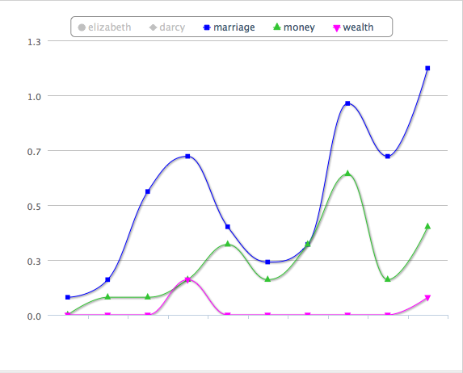

##Voyant Tools 
###[Start working with Voyant](http://docs.voyant-tools.org/tools/) 

###Overview 

Voyant Tools is a suite of online text analysis software created by Stéfan Sinclair and Geoffrey Rockwell. Uses for the tools include tracking word frequency, word collocation, and visualizing trends in texts both large and small (charting instances of diction, repeated concepts, characters, etc.). Voyant can be used to prompt close reading, track trends across one or multiple novels, and visualize trends in student writing.

###Documentation 

Voyant works with a range of file types, including plain text, RTF, XML, PDF, and .doc and .docx files (among others). Choose the tools you would like to work with and input text either by uploading files or copy-and-pasting.

<!--	Exported from http://voyeurtools.org/.
	Please note that this is an early version and the API may change.
	You are strongly encouraged to subscribe to a list to receive notifications
	of updates to Voyant (updated code, planned outages, etc.) – please send
	a message to sgsinclair@voyeurtools.org. -->
<form action='http://voyeurtools.org/tool/TypeFrequenciesChart/' method='get' target='_blank'>
<input type='hidden' name='corpus' value="1377376915395.6277" />
<input type='hidden' name='docIdType' value="d1377320760502.b850c41d-542e-ae60-fb0d-c7b5a83bef5e:a" />
<input type='hidden' name='docIdType' value="d1377320760502.b850c41d-542e-ae60-fb0d-c7b5a83bef5e:marriage" />
<input type='hidden' name='docIdType' value="d1377320760502.b850c41d-542e-ae60-fb0d-c7b5a83bef5e:money" />
<input type='hidden' name='docIdType' value="d1377320760502.b850c41d-542e-ae60-fb0d-c7b5a83bef5e:wealth" />
<input type='hidden' name='mode' value="document" />
<input type="submit" value="View Word Trends in Voyant." />
</form>

<!--	Exported from http://voyeurtools.org/.
	Please note that this is an early version and the API may change.
	You are strongly encouraged to subscribe to a list to receive notifications
	of updates to Voyant (updated code, planned outages, etc.) – please send
	a message to sgsinclair@voyeurtools.org. -->
<iframe width="480" height="369" src="http://voyeurtools.org/tool/Cirrus/?corpus=1364685340542.3762&query=&stopList=stop.en.taporware.txt&docIndex=0&docId=d1364616655627.77bf5027-f91d-74d6-8207-e4e2e405faf2"></iframe>

Detailed instructions are included with the Voyant Tools [documentation](http://docs.voyant-tools.org/start/) and [screencast tutorials](http://docs.voyant-tools.org/videos/).

##Suggested Activities 

###Close reading at scale 

Use the [cirrus word cloud generator](http://voyeurtools.org/tool/Cirrus/) to visualize two or more related scenes for close reading. Ask students first to identify word trends or patterns within each visualization and then to construct arguments that connect the similarities or differences between the two visualizations. Each visualization can draw from one passage or combine a number of related passages.

####Example 

This example deals with Shakespeare's "Measure for Measure." Collect different passages which describe Angelo and Isabella, then visualize each collection of text as a word cloud. Ask students to consider what words are similar within each visualization and what the related words suggest about the characterization of Isabella and Angelo, respectively. Then ask students to compare the two characterizations by reading across both visualizations.

Angelo's passions (embodied)

Isabella's virtue (enskied)

* Added by [Alex Christie](http://www.twitter.com/axchristie)

###Tracking concepts across text(s) 

Use the [Bubblelines](http://voyeurtools.org/tool/Bubblelines/) or [Corpus Term Frequencies](http://voyeurtools.org/tool/CorpusTypeFrequenciesGrid/) to identify related keywords, concepts, or characters across one or multiple works. Present the class with one or two visualizations that suggests a relationship; ask students to argue for or against the trend and support their positions with evidence from the text (discoverable using the keywords in context window).

####Example 

Visualize word trends in Jane Austen's *Pride and Prejudice* to compare the relationship between money, marriage, and wealth. Is there a relationship between marriage and money in the novel. If so, what evidence exists to characterize it? Why does wealth deviate from the observed trend? Is there a reason why references to wealth only trend at certain points in the novel?

* Added by [Alex Christie](http://www.twitter.com/axchristie)

###Viewing trends in student writing 

Use text analysis to visualize trends in student writing. Do certain patterns emerge across student work that the class can reflect upon? Voyant Tools can be used to present common points of difficulty in assignments and offer an engaging interface for students to examine their writing habits.