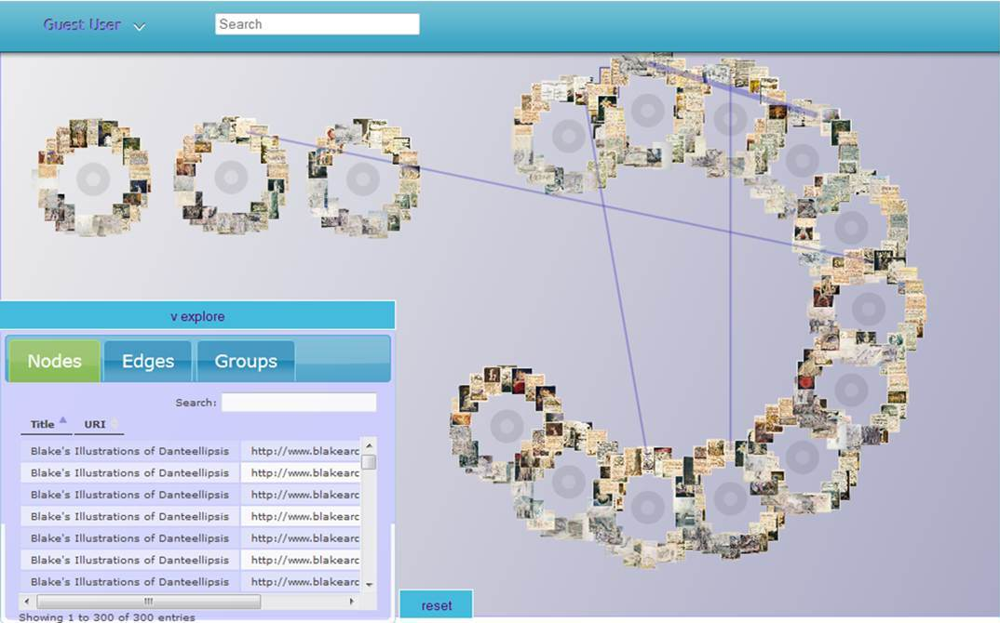

##NewRadial 

###[Start teaching with NewRadial](http://inke.acadiau.ca/newradial-dev/) 

###Overview 

New Radial is an online tool that lets users visualize both corpora of texts and individual elements of a single text. This can include search results in online archives, groupings of texts and related secondary materials, and individual texts that can be close read using the NewRadial interface. The tool also allows scholars and students to collaboratively annotate imported collections, offering a web-based venue for collaborative research.

NewRadial can be used online via [inke.acadia.ca](http://inke.acadiau.ca/newradial-dev/) and is also available for [download via SourceForge](http://sourceforge.net/projects/newradial-inke/).

###Documentation 

<iframe src="http://inke.acadiau.ca/newradial-dev/?newradial-adapter=true" class="responsiveFrame"></iframe>

Explore the interactive NewRadial documentation above.

Read the [print documentation for NewRadial]({{ site.baseurl }}/assets/docs/tools/NewRadial_late2014.pdf).

##Suggested Activities 

###Close reading <i>The Yellow Wallpaper</i> 

Amy Robinson's assignment asks students to read Charlotte Perkins Gilman's <i>The Yellow Wallaper</i> using NewRadial, moving past thematic or trope-based readings to examine the structure of the text. As Robinson writes: "I started by asking them to show using the nodes...not what the story 'means' but what it does...how different elements are connected." This activity occurs in two parts. First, divide the students into groups and ask each group to explore a different path through the text to experience the story piece-by-piece. Second, invite the class to discuss how different paths enable related readings of the story. This exercise asks students to push beyond thematic readings of individual tropes of images to identify recurring elements in the text and explore interpretive connections between them.

View [The Yellow Wallpaper on NewRadial](http://inke.acadiau.ca/newradial-dev/?collections-adapter=true&collections-adaptercollection=44). Read "[Digital Humanities Pedagogy: Encouraging Critical Analysis of Digital Technology in the Classroom](http://inke.ca/2015/01/15/digital-humanities-pedagogy-encouraging-critical-analysis-of-digital-technology-in-the-classroom/)" by [Amy Robinson](mailto:amyrobinson@acadiau.ca).

###Teaching student-centered group research

While students are often asked to conduct research both individually and in group-based settings, they are rarely invited to make their research practices explicit and to build their research methods collaboratively. This week-long exercise asks students to conduct group research using NewRadial and present their evolving research methods and practices to their classmates. Divide the class into groups of four-to-five students and assign each group a different text (this text may be a literary novel or short story, a contemporary journal article, or the like). Ask each group to develop an argument about the text and find five-to-ten secondary sources that support or refute their thesis. Students must then visualize their sources as a collection in NewRadial, creating a node for each piece of evidence taken from a secondary source. At the end of the week, each group will present their collection to the class, emphasizing how and where they discovered their sources and discussing their plans to integrate these sources into an academic argument. As a follow-up to this exercise, you may ask each student to freewrite a draft paper based on their Radial(s) and exchange it with a peer. Assignment by [Alex Christie](https://twitter.com/axchristie).

###Using NewRadial to synthesize sources and develop research topics

As students begin exploring topics for a major research paper, ask them to conduct research using the NewRadial adapters online and gather a related sources into a Radial. Students must then annotate each source and create a related node for exploring potential research topics and working thesis statements that synthesize the Radial of research sources.